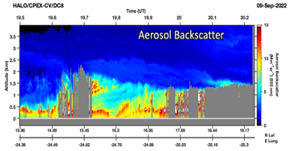

# Machine Learning for Predicting Aerosol Mixed Layer Heights 


***

# Introduction 

The planetary boundary layer height (PBLH) influences various troposheric processes including aerosol distributions, convection, and cloud formation. However, its complex evolution challenges observations in the PBL. Currently, NASA Langely employs airborne High Spectral resolution lidars (HSRL) and Differential Absorption Lidars (DIAL) to obtain vertical profiles of various atmospheric constituents at high spatial and temporal evolutions. These observables play a crucial role in the derivation of the aerosol mixed layer height (e.g. one method to desribe the PBLH; the height by which aerosols are well dispersed). Currently, MLHs are derived using an algorithm based on the Haar wavelet covariance transform method (WCT), which relies upon manually-adjusted threshold values for accurate MLH estimates. In addition, the estimations require a time-consuming quality-inspection process to correct remaining outliers. 

To create an automized algorithm, this project utilized datasets from two airborne lidar field campaigns (CPEX-AW (2021) and ACT-America (2019)) as inputs to a supervised machine learning algorithm. A regression-based algorithm was selected (i.e. the ensemble learning model). This model was used to compute automized MLHsfor five flights within ACT-America and CPEX-AW. Overall, increased model performance compared to the default method with the inclusion of ensemble learning methods, illustrating an advantage for automizing mixed layer height prediction. Further work is needed to address more complex scenes and environments increased prediction accuracy. 

# Data

## Background
The lidar dataset is comprised of data from two field campaigns ACT-America and CPEX-AW. 

**ACT-America 2019** (Atmospheric Carbon and Transport - America):
* <u>Location:<u> Eastern U.S. 
* <u>Mission Background:<u> Airborne campaign to study the transport and fluxes of atmospheric carbon dioxide and methane
* Instrument: HALO (High Altitude Lidar Observatory)

**CPEX-AW 2021** (Convective Processes Experiment - Aerosols and Winds):
* Location: St. Croix 
* Mission Background: Airborne campaign to study dynamics and microphysics related to the Saharan Air Layer, African Easterly Waves and Jets, Tropical Easterly Jet, and deep convection in the ITCZ. 
* Instrument: HALO (High Altitude Lidar Observatory)



*Figure 1: Example of observables and products obtained from airborne lidar.*

## Predictor Selection

Since the current method of MLH prediction relies upon specific thresholds, the predictors included are selected mainly to weigh the sensitivity of thresholds.
| No. | Description                                                 |
| --- | ----------------------------------------------------------- |
| 1)  | MLH (Thresh = 0.00001)                                     |
| 2)  | MLH (Thresh = 0.0001)                                      |
| 3)  | MLH (Thresh = 0.001)                                       |
| 4)  | MLH (Thresh = 0.01)                                        |
| 5-9)| Vertical Variance in 532nm Backscatter Gradient (360m above and below MLHs)|
| 10-13) | Temporal Variance in MLHs associated with predictors 1-4  |
| 14) | Solar Hour Angle                                           |
| 15) | Terrain Flag (land = 0; water = 1)                         |

## Reference Data

The quality-checked, MLHs serve as the refernce data for the training and testing data. Thresholds were adjusted manually and by eye to capture the correct aerosol gradient. 


*Figure 2: Quality-Checked MLHs shown for a flight on June 24, 2019 during the ACT-America campaign.*

# Modelling

A **supervised learning** approach was implemented to predict altitudes of mixed layer heights (in meters) for multiple flights within the ACT-America and CPEX-CV field campaigns. 23 flights were randomized and split into training (19 flights) and testing (5 flights). A regression ensemble approach was implemented to model the heights. 

## Implementation
```matlab
treeTemplate = templateTree('Surrogate','on','MaxNumSplits',200);
ensemble = fitrensemble(train_data,train_arch,'Method','Bag','Learners',treeTemplate);
save('ensemble_model.mat','ensemble');

mlh_ens = cell(length(sp1_tst), 1);
%Make Predictions for each flight
for i = 1:length(testFiles)
    test_MLH = sp1_tst{i};
    nan_index = find(isnan(test_MLH));
    test_data = [sp1_tst{i}', sp2_tst{i}', sp3_tst{i}', sp4_tst{i}',svvar_p1_tst{i}', svvar_p2_tst{i}', svvar_p3_tst{i}', svvar_p4_tst{i}',shvar_p1_tst{i}', shvar_p2_tst{i}', shvar_p3_tst{i}', shvar_p4_tst{i}',shangle_tst{i}',sflag_tst{i}'];
    %Ensemble Prediction + recover units
    ens_dat = predict(ensemble,test_data).* (max_arch - min_arch) + min_arch;
    ens_dat(nan_index) = nan;
    mlh_ens{i} = ens_dat';
end
```

# Results

## Predictor Importance 


*Figure 3: Predictor importance for ensemble learning method.*

## Summary Statistics 

| Method                | NMB   | NME   | MB     | ME    | RMSE   | CORR |
|-----------------------|-------|-------|--------|-------|--------|------|
| Default               | -0.04 | 0.19  | -41.31 | 193.21| 324.94 | 0.81 |
| Ensemble Learning     | -0.01 | 0.09  | -14.14 | 92.94 | 157.39 | 0.96 |


*Table 1: Summary of Ensemble and default model performance.*

To assess the performance of the ensemble learning model, predicted values were evalated against the quality-checked MLHs (observed values). In addition, the performance of the default method was assessed for comparison. 

## Summary Plots


*Figure 4: Summary of the observed vs. predicted values for 5 test flights.*


*Figure 5: Summary of the residuals for 5 test flights.*


## Test Flight Results


*Figure 6: Predicted MLHs for ensemble (magenta) and quality-checked (white) methods for June 10, 2019 (ACT-America).*


*Figure 7: Predicted MLHs for ensemble (magenta) and quality-checked (white) methods for August 28, 2021 (CPEX-AW).*

# Discussion


# Conclusion

Here is a brief summary. From this work, the following conclusions can be made:
* first conclusion
* second conclusion

## Future Work
Future work on this topic would benefit from incorporating additional lidar field campaign data (e.g., LISTOS, ACTIVATE, TRACER-AQ, CPEX-CV, CAMP2Ex), lidar observables (1064mm aerosol depolarization, relative humidity, water vapor mixing ratio, aerosol typing), and PBLHs derived from different methods (PBLH derived from dropsonde data).


# References
[1] DALL-E 3

[back](./)

