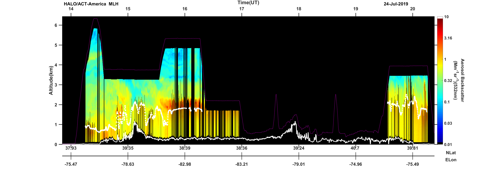
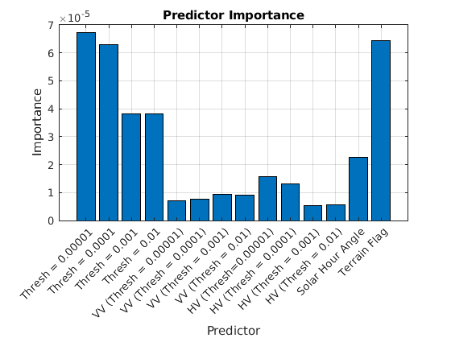
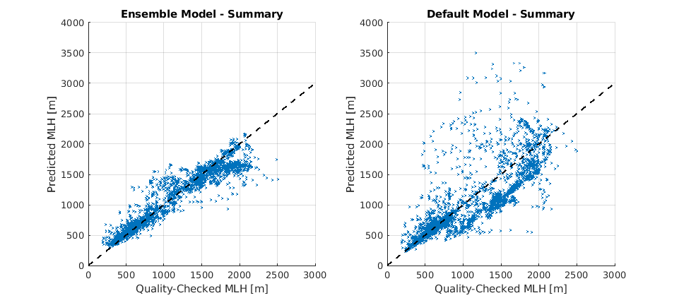
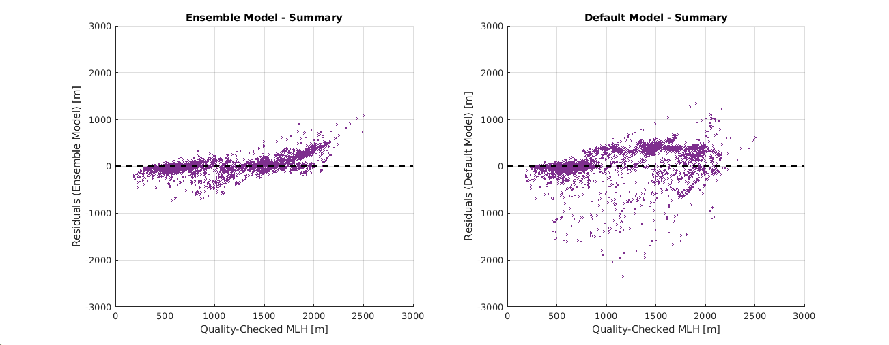
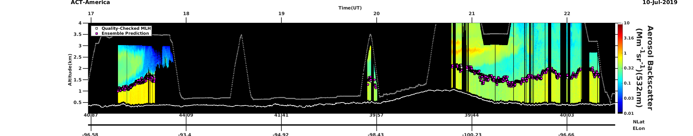
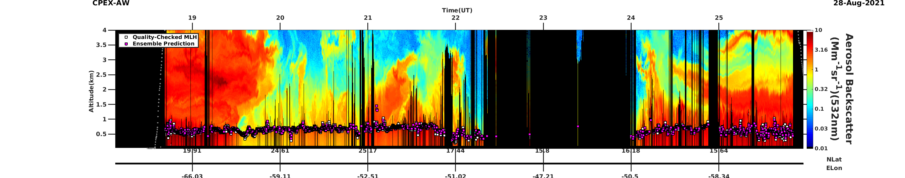

# Machine Learning for Predicting Aerosol Mixed Layer Heights 


***

# Introduction 

The planetary boundary (PBL) is the lowest, turbulent layer of the atmosphere and serves to facilitate a multitude of feedbacks in the atmosphere, including those between the atmosphere, ocean, and land. The height of the boundary layer (PBLH) is responsible for governing many tropospheric activities, such as aerosol distributions, convection, and cloud formation [1]. Its complex evolution challenges observations of the PBL. NASA Langley (LaRC) hosts a suite of airborne High Spectral Resolution Lidars (HSRL) and differential absorption lidars (DIAL), whose observables of aerosol properties (532nm backscatter) aid in identifying the PBLH. The term mixed layer height (MLH) is one way to describe the height of the boundary layer when it is determined from aerosol gradients.

This project aims to improve MLH estimates derived from airborne HSRLs to allow for more automated retrievals over a wide range of atmospheric and surface conditions. Currently, the LaRC airborne lidar algorithm utilizes the Haar wavelet covariance transform method [2,3,4] to derive MLHs. In this approach, a Haar wavelet function is used to transform a 532nm lidar backscatter profile. The lowest altitude maximum of the transform is determined to be the height of the boundary layer. The algorithm’s implementation on HSRL datasets is mostly automized, although it requires manual inputs of threshold values for WCT peak detection. In addition, a final manual quality control phase is needed to correct remaining outliers by utilizing other observations or based on intuitive situations [5]. It is thus evident, further research is needed to create a more robust and automated MLH algorithm. In other words, an algorithm that can produce reliable MLHs without the need of manual adjustments. 

To address this, a supervised machine learning approach is taken using ensemble learning (regression method). Two lidar field campaigns are selected (CPEX-AW (2021), ACT-America (2019) to predict MLHs for several test flights over land and over the ocean. The resulting predictions are evaluated against the quality-checked MLHs and a default method to assess improvement. Overall, increased model performance with the inclusion of ensemble learning was observed compared to the default method of prediction, illustrating the advantage of automizing MLH predictions. 

# Data

## Background

This project utilizes field campaign datasets obtained from the LaRC High Altitude Observatory Instrument (HALO), which employs the HSRL and DIAL techniques to provide profiles of aerosols intensive and extensive properties,and water vapor. Data is selected from two NASA field campaigns, ACT-America (2019) and CPEX-AW (2021). These two campaigns are chosen because they are representative marine- (CPEX-AW) and terrestrial-type (ACT-America) planetary boundary layers, allowing for variability in PBLH scenes. 

**ACT-America 2019** (Atmospheric Carbon and Transport - America):
* <u>Location:<u> Eastern U.S. 
* <u>Mission Background:<u> Airborne campaign to study the transport and fluxes of atmospheric carbon dioxide and methane
* Instrument: HALO (High Altitude Lidar Observatory)

**CPEX-AW 2021** (Convective Processes Experiment - Aerosols and Winds):
* Location: St. Croix 
* Mission Background: Airborne campaign to study dynamics and microphysics related to the Saharan Air Layer, African Easterly Waves and Jets, Tropical Easterly Jet, and deep convection in the ITCZ. 
* Instrument: HALO (High Altitude Lidar Observatory)

## Predictor Selection

*Table 1.* illustrates the predictors selected for the ensemble learning algorithm. The first four predictions represent various MLHs derived using the WCT method for constant thresholds, ranging from 0.00001-0.01. These thresholds fall within the range of the typical thresholds selected in the current MLH algorithm. These height predictors are used to test the sensitivity of particular threshold values. Predictors 5-9 are associated with these four height predictors. The variance of the 532nm aerosol backscatter gradient is computed 360m above and below the MLHs associated with the first four predictors. Predictors 10-13 are also associated with the first four height predictors. These predictors were computed as the horizontal variance in MLHs. A temporal variance is computed for 10-time steps before and after each of the derived heights (data is available every 10s). Next, the solar hour angle is computed from the geographic variables (i.e. gps latitude, gps longitude). This was selected as a predictor to help capture the development of the boundary layer based on the diurnal cycle. Lastly, I computed a terrain flag based on the geographical coordinates of the observations. The terrain flag is incorporated to help the algorithm identify between marine- and terrestrial-type MLHs. 

| No. | Description                                                 |
| --- | ----------------------------------------------------------- |
| 1)  | MLH (Thresh = 0.00001) [m]                                     |
| 2)  | MLH (Thresh = 0.0001) [m]                                      |
| 3)  | MLH (Thresh = 0.001) [m]                                      |
| 4)  | MLH (Thresh = 0.01)  [m]                                      |
| 5-9)| Vertical Variance in 532nm Backscatter Gradient (360m above and below MLHs)|
| 10-13) | Temporal Variance in MLHs associated with predictors 1-4  |
| 14) | Solar Hour Angle [degrees]                                          |
| 15) | Terrain Flag (land = 0; water = 1)                         |

*Table 1: Predictors incorporated in the ensemble learning MLH algorithm.*

## Reference Data

The reference data for the ensemble learning algorithm is comprised of the quality-checked/manually adjusted MLHs. This dataset was used as the "truth" or the "observed" values to evaluate the machine learning results. Time dependent threshold were selected at the beginning of the algorithm for optimal MLH estimation. Remaining outliers were corrected through visual inspection by the Langley lidar group. This data is openly available at: https://science.larc.nasa.gov/lidar/campaigns/?doing_wp_cron=1680100527.0150070190429687500000. An example of what these MLHs look like for a flight is shown in *Fig. 1*. 



**Figure 1*: Quality-Checked MLHs shown for a flight on June 24, 2019 during the ACT-America campaign.*

# Modelling

Before implementing the ensemble model, all the data in the training and testing datasets was standardized using the minimums and maximums (see code snippet below) of each respective predictor in the training dataset. The testing dataset was standardized with the minimums and maximums from the training set to eliminate any possibility of bias. 

## Data Standardization

```matlab
%-- Find Minimums and Maximums -- 
[min_tr, max_tr] = cellfun(@find_range, predic_all_tr, 'UniformOutput', false);
[min_p1, min_p2, min_p3, min_p4,min_vvar_p1, min_vvar_p2, min_vvar_p3, min_vvar_p4, min_hvar_p1, min_hvar_p2, min_hvar_p3, min_hvar_p4, min_hangle,min_flag] = min_tr{:};

[max_p1, max_p2, max_p3, max_p4,max_vvar_p1, max_vvar_p2, max_vvar_p3, max_vvar_p4,max_hvar_p1, max_hvar_p2, max_hvar_p3, max_hvar_p4, max_hangle,max_flag] = max_tr{:};

%Archived Mins and Maxs
[min_arch, max_arch] = find_range(arch_tr);

%-- Standardize Values for Machine Learning --
std_values_tr = cellfun(@(x, min_val, max_val) standardizeData(x, min_val, max_val), predic_all_tr, min_tr, max_tr, 'UniformOutput', false);
[sp1_tr, sp2_tr, sp3_tr, sp4_tr,svvar_p1_tr, svvar_p2_tr, svvar_p3_tr, svvar_p4_tr,shvar_p1_tr, shvar_p2_tr, shvar_p3_tr, shvvar_p4_tr,shangle_tr,sflag_tr] = std_values_tr{:};
[sarch_tr] = standardizeData(arch_tr,min_arch,max_arch);
```
A **supervised learning** learning approach was implemented to predict altitudes of mixed layer heights (in meters) for multiple flights within the ACT-America and CPEX-CV field campaigns. 23 flights were randomized and split into training (19 flights) and testing (5 flights). A regression ensemble approach (random forest) was implemented to model the height values. This was the chosen algorithm for several reasons. The availability of lidar data is dependent on clear-sky conditions, as such, the backscatter profiles are cloud screened. As a result, large sections of data are often missing from certain flights due to the prescense of clouds. Since the ensemble learning algorithm is known for handling missing data well and leveraging other available predictors when approached with missing values, it seemed best to implement on this dataset. In addition, it is known for handling complex nonlinear relationships (seen often with MLH development) and its ability to handle a large number of features without overfitting. These attributes made this model suitable for solving the mixed layer height atomization problem. 

Bootstrap aggregation (bagging) was selected to reduce overfitting and to lower the impact of outliers within the training dataset. Additionally, I opted to enable surrogate decision splits. I opted for this method since several of the predictors contained missing data. This way, if a predictor was missing for a particular observation, a decision could be made based on the other available predictors. Lastly, for each tree in the ensemble, the MaxNumSplits was set to 200 to restrict the tree depth and control its complexity. This value was chosen after assessing model performance for multiple test cases. 


## Model Implementation
```matlab
treeTemplate = templateTree('Surrogate','on','MaxNumSplits',200);
ensemble = fitrensemble(train_data,train_arch,'Method','Bag','Learners',treeTemplate);
save('ensemble_model.mat','ensemble');

mlh_ens = cell(length(sp1_tst), 1);
%Make Predictions for each flight
for i = 1:length(testFiles)
    test_MLH = sp1_tst{i};
    nan_index = find(isnan(test_MLH));
    test_data = [sp1_tst{i}', sp2_tst{i}', sp3_tst{i}', sp4_tst{i}',svvar_p1_tst{i}', svvar_p2_tst{i}', svvar_p3_tst{i}', svvar_p4_tst{i}',shvar_p1_tst{i}', shvar_p2_tst{i}', shvar_p3_tst{i}', shvar_p4_tst{i}',shangle_tst{i}',sflag_tst{i}'];
    %Ensemble Prediction + recover units
    ens_dat = predict(ensemble,test_data).* (max_arch - min_arch) + min_arch;
    ens_dat(nan_index) = nan;
    mlh_ens{i} = ens_dat';
end
```

# Results

## Predictor Importance 



**Figure 2*: Predictor importance for ensemble learning method.*

To gain insight as to which predictors held the most weight, the predictor importance plot for the ensemble model was outputted. The predictor importance plot illustrates the relevance of the predictors in determining the MLH estimates. Unsurprisingly, the height predictors hold the highest importance since they describe the mixed layer well. The solar hour angle and the terrain flag were the next variables to stand out. The high solar hour angle value suggests the importance of the diurnal cycle for determining boundary layer development, while the significant importance of the terrain flag hints at the important distinction between marine- (CPEX-AW) and terrestrial-type (ACT-America) MLHs. 

## Summary Statistics 

| Method                | NMB   | NME   | MB     | ME    | RMSE   | CORR |
|-----------------------|-------|-------|--------|-------|--------|------|
| Default               | -0.04 | 0.19  | -41.31 | 193.21| 324.94 | 0.81 |
| Ensemble Learning     | -0.01 | 0.09  | -14.14 | 92.94 | 157.39 | 0.96 |

*Table 2: Summary of Ensemble and default model performance.*

To assess the performance of the ensemble learning model, predicted values were evaluated against the quality checked MLHs (observed values). In addition, the performance of a default method was assessed for comparison. The default method simply involves the computation of the second predictor (MLH with threshold of 0.0001). This height typically serves as the first step in the current manual algorithm (threshold values are tuned after) The statistics in *Table 2.* are representative of the results for all the test flights. **The ensemble learning method is representative of well correlated predictions (>0.9), in addition to reduced NMB, NME, MB, ME, and RMSE compared to the default method. ** Such results highlight the advantages of an automized algorithm: results that are close to the observed without the need of manual inspection. 

## Summary Plots



**Figure 3*: Summary of the observed vs. predicted values for 5 test flights.*



**Figure 4*: Summary of the residuals for 5 test flights.*

The plots in *Fig. 4* and *Fig 5.* illustrate the performance of the predictions against the observations (quality checked MLHs). *Fig. 5* illustrates a much closer relationship to the one-to-one line compared to the default method. However, it is clear there is still some room for improvement. The ensemble learning method tends to underpredict deeper MLHs (> 1500m) and overpredict MLHs around 1000m. This is evident in the residuals (Fig 5.) as well. The deviations from the observed values suggests the model may be suffering from overfitting. This is most likely attributed to a small dataset, suggesting further work is needed to resolve these issues. Regardless, there is much greater improvement compared to the default method with the inclusion of this automized machine learning method.  

## Test Flight Results

Below are backscatter curtain plots illustrating the modeled (magenta) and quality checked MLHs for two flights in the test dataset. *Figures 5* and *6* are representative of terrestrial- and marine-based boundary layers respectively. As shown, terrestrial boundary layers experience more turbulent mixing (varied backscatter gradients shown) while marine boundary layers contain high aerosol loading and less turbulent mixing (as shown). These figures illustrate the model's capability of capturing a MLH that is representative of the archived, quality-checked values, even when approached with complex scenes. In these cases, correlations were significant (>0.9) and the erros/biases were relatively low compared to the observed values.


### 20190710 ACT-America Test Flight 



**Figure 5*: Predicted MLHs for ensemble (magenta) and quality-checked (white) methods for June 10, 2019 (ACT-America).*

| Method              | NMB   | NME   | MB      | ME     | RMSE   | CORR |
|---------------------|-------|-------|---------|--------|--------|------|
| Ensemble Learning   | -0.02 | 0.04  | -30.27  | 69.42  | 92.69  | 0.94 |

**Table 3*: Ensemble model performance for a flight on June 10, 2019.*

### 20210828 CPEX-AW Test Flight 


**Figure 6*: Predicted MLHs for ensemble (magenta) and quality-checked (white) methods for August 28, 2021 (CPEX-AW).*

| Method            | NMB   | NME   | MB    | ME    | RMSE   | CORR |
|-------------------|-------|-------|-------|-------|--------|------|
| Ensemble Learning | 0.02  | 0.06  | 12.07 | 34.92 | 58.42  | 0.89 |

**Table 4*: Ensemble model performance for a flight on August 28, 2021.*

# Conclusion

Robust, accurate estimates of MLHs are crucial for understanding various processes within the troposphere. The current method of MLH prediction is far from automized, requring manually-derived time dependent thresholds to determine an optimal estimate. This project aimed to move away from this time-consuming process by utilizing the automization potential of machine learning. A supervised machine learning approach was taken to help automize MLH prediction with regression in an attempt to produce results similar to those of the quality-checked MLHs. Leveraging observables from the High-Altitude Lidar Observatory (HALO) and datasets from two airborne field campaigns (ACT-America (2019) and CPEX-AW (2021), I was able to produce automized MLHs for 5 test flights using an ensemble learning method (random forest). 

The results revealed the following: **1) comparable MLHs to the quality-checked observables (Figures 5,6) and 2) improved estimates from the default MLH method are possible with the inclusion of an ensemble learning method (Table 2) **. However, it is clear there is room for improvement.  *Figures 3* and *4* illustrate the tendency of the ensemble learning model to underpredict larger MLH values (> 2000m) and overpredict values ~1000m as evidenced by the large errors that are still present in *Table 2*. Further work is thus needed in this topic is needed to make such improvements (see **Future Work**). 

Overall, improvements in aerosol mixed layer height prediction will prove useful for many research applications. For example, in an air quality contex, such MLHs could serve to enhance chemical models (WRF-Chem) and deepen our understanding of PBL-air quality interactions.

# Future Work

A number of approaches can be taken to further develop this automized algorithm: 

* 1)**It would be beneficial in the future to include more MLH scenes from different contexts (e.g. observations from different times, regions, environments)**. Providing more complex scenes in different regions could provide more context for the algorithm. Field campaigns such as 2020 ACTIVATE, 2021 ACTIVATE, 2022 ACTIVATE, CAMP2Ex (2019), LISTOS (2018), TRACER-AQ (2021), and CPEX-CV (2022) could be incorporated into such an algorithm. 

* **In addition, several other lidar observables could prove to be useful in addition to the predictors shown in this project**.For example, 1064nm aerosol depolarization, relative humidity, and mixing ratio gradients could be used as predictors to characterize the height of the boundary layer as well. 

* 3)**Lastly, an independent dataset is needed to provide additional evaluation**. For the marine-based field campaigns, dropsondes were launched during many of the research flights providing vertical profiles of the atmosphere. PBLHs derived from those measurements could provide an additional independent dataset to evaluate the ensemble learning algorithm. The incorporation of these variables and independent data could prove useful in correcting the algorithm further. 

# References

* [1] Liu, S., & Liang, X. Observed Diurnal Cycle Climatology of Planetary Boundary Layer
Height. Journal of Climate, 23(21), 5790-5809 (2010).

* [2] Burton, S. P., Ferrare, R. A., Hostetler, C. A., Hair, J. W., Rogers, R. R., Obland, M. D.,
Butler, C. F., Cook, A. L., Harper, D. B., and Froyd, K. D.: Aerosol classification using
airborne High Spectral Resolution Lidar measurements – methodology and examples.
Atmos. Meas. Tech., 5, 73–98 (2012).

* [3]Brooks, I. M.: Finding boundary layer top: Application of a wavelet
covariance transform to lidar backscatter profiles, J. Atmos.
Oceanic Tech., 20, 1092–1105, 2003.

* [4] Davis, K.J., Gamage, N., Hagelberg, C., Kiemle, C., Lenschow, D.,
and Sullivan, P.: An objective method for deriving atmospheric
structure from airborne lidar ob

* [5] Scarino, A. J., Obland, M. D., Fast, J. D., Burton, S. P., Ferrare, R. A., Hostetler, C. A.,
Berg, L. K., Lefer, B., Haman, C., Hair, J. W., Rogers, R. R., Butler, C., Cook, A. L., and
Harper, D. B.: Comparison of mixed layer heights from airborne high spectral resolution
lidar, ground-based measurements, and the WRF-Chem model during CalNex and
CARES, Atmos. Chem. Phys., 14, 5547–5560 (2014).


[back](./)

